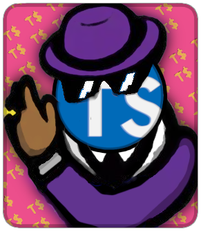

# TS Pimp



### Keep your types in check 😎

To install dependencies:

```bash { background=true interactive=false }
#!/usr/bin/env bash
bun install
```

To run:

```bash
#!/usr/bin/env bash
bun run start
```

To check types:

```sh { name=check background=true interactive=false }
#!/usr/bin/env bash
bun run check

```

To run tests:

```sh { name=test closeTerminalOnSuccess=true interactive=true }
#!/usr/bin/env bash
bun test
```

or in watch mode:

```sh { name=test-watch }
#!/usr/bin/env bash
bun test --watch
```

This project was created using `bun init` in bun v0.6.8. [Bun](https://bun.sh) is a fast all-in-one JavaScript runtime.
