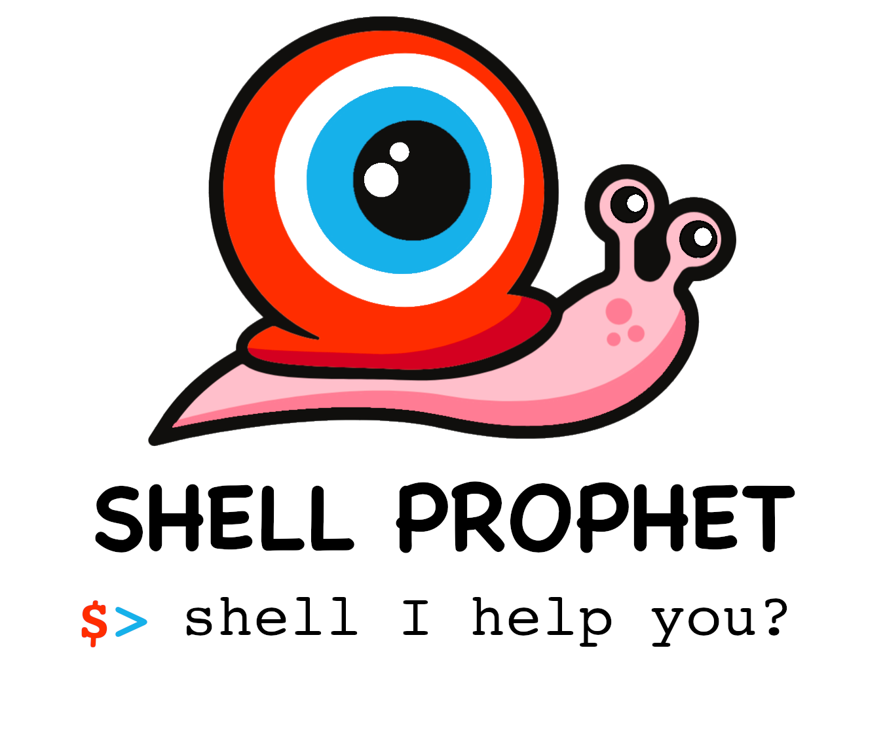

# Shell Prophet

provide usefull command "sp" that can do this:

```bash
sp ai list all files in directory as a tree and show its size
```

To install dependencies:

```bash
bun install
```

To run:

```bash
bun run src/index.ts
```
